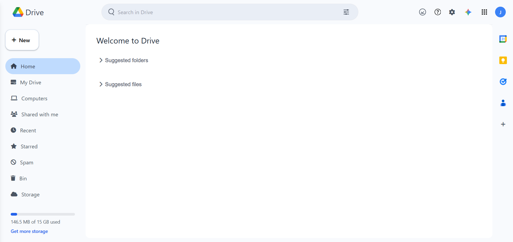

<div align="center">
  
  <h1>Google Drive UI Clone</h1>
  <h4>A responsive Google Drive interface clone built with 
      <a href="https://tailwindcss.com" target="_blank">Tailwind CSS</a> and HTML.</h4>

  <p>
    <a href="https://jatinsoni08.github.io/GoogleDriveClone/">View Live Demo</a> ·
    <a href="https://github.com/jatinsoni08/GoogleDriveClone/issues">Report Bug</a> ·
    <a href="https://github.com/jatinsoni08/GoogleDriveClone/issues">Request Feature</a>
  </p>

  <p>
    
    
    
    
  </p>

  <p>
    <a href="#key-features">Key Features</a> •
    <a href="#tech-stack">Tech Stack</a> •
    <a href="#responsive-design">Responsive Design</a> •
    <a href="#installation">Installation</a> •
    <a href="#usage">Usage</a> •
    <a href="#preview">Preview</a> •
    <a href="#license">License</a>
  </p>

  <div style="display: flex; justify-content: center; gap: 20px; flex-wrap: wrap;">
     <br>
    
  </div>
</div>

---

## ✨ Key Features

- **📱 Fully Responsive Design** - Optimized for mobile, tablet, and desktop screens
- **🎨 Modern UI** - Clean interface with Google Drive's signature styling
- **🧭 Sidebar Navigation** - Collapsible sidebar with all essential Drive options
- **🍔 Mobile Drawer** - Hamburger menu for mobile devices
- **⚡ Interactive Elements** - Toggle sections for suggested folders and files
- **🎯 Pure Tailwind CSS** - No custom CSS, only Tailwind utility classes
- **🔔 Notification Badges** - Visual indicators for important information
- **🌈 Beautiful Icons** - Font Awesome icons for a polished look

---

## 🛠️ Tech Stack

| Technology | Purpose |
|------------|---------|
|  **HTML5** | Semantic markup structure |
|  **Tailwind CSS** | Utility-first CSS framework |
|  **Font Awesome** | Icons library |
|  **Vanilla JavaScript** | Minimal JS for interactive elements |

---

## 📱 Responsive Design

This Google Drive clone is designed to work flawlessly across all device sizes:

| Device | Layout Features |
|--------|----------------|
| **📱 Mobile** (< 768px) | Bottom navigation bar, hamburger menu, hidden sidebars |
| **📟 Tablet** (768px - 1024px) | Left sidebar visible, right sidebar hidden |
| **💻 Desktop** (> 1024px) | Both left and right sidebars visible |

---

## 🚀 Installation

No build process required! Simply follow these steps:

1. **Clone the repository**
   ```bash
   git clone https://github.com/jatinsoni08/GoogleDriveClone.git
